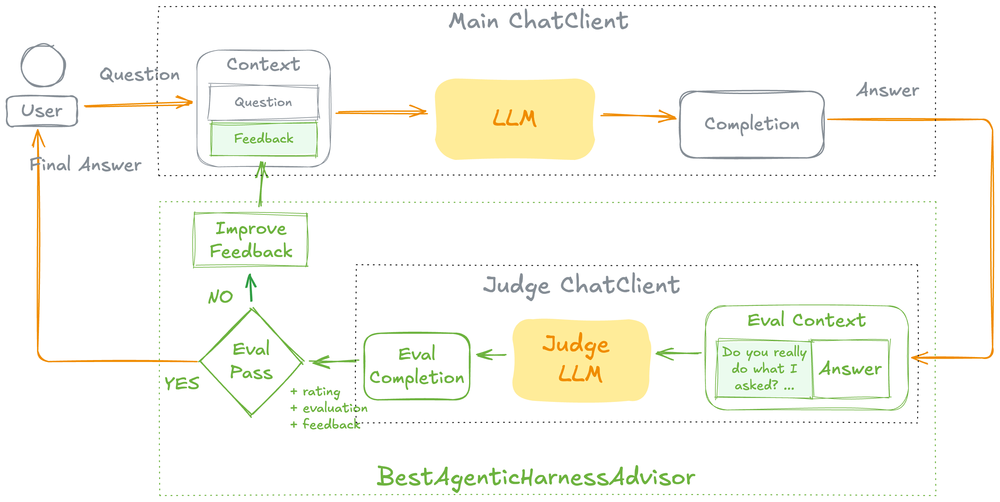

# Best Agentic Harness

**A Spring AI advisor that implements LLM-as-a-Judge evaluation with automatic retry.**

## What is Best Agentic Harness?

Best Agentic Harness provides a Spring AI advisor — `BestAgenticHarnessAdvisor` — that evaluates LLM responses using **point-wise scoring** and automatically retries failed attempts with feedback.

Inspired by [this LinkedIn post](https://www.linkedin.com/feed/update/urn:li:activity:7424629895361740801/) on agentic evaluation patterns.

## Key Features

- :material-gavel: **LLM-as-a-Judge** — Uses a separate LLM to evaluate response quality on a 1–4 scale
- :material-refresh: **Automatic Retry** — Retries with evaluation feedback appended to the prompt when the rating is below threshold
- :material-leaf: **Spring AI Native** — Integrates as a standard Spring AI advisor via `ChatClient`

## Get Started

-   :material-rocket-launch: **Quickstart**

    ---

    Add the advisor to your project and start evaluating responses.

    [:octicons-arrow-right-24: Get started](quickstart.md)

-   :material-cog: **How It Works**

    ---

    Understand the evaluation and retry flow in detail.

    [:octicons-arrow-right-24: Learn more](how-it-works.md)

-   :material-tune: **Configuration**

    ---

    Explore all available configuration options.

    [:octicons-arrow-right-24: Configure](configuration.md)

-   :material-flask: **Demo Advisors**

    ---

    Learn about the included demo advisors for testing.

    [:octicons-arrow-right-24: Explore](demo-advisors.md)

## Requirements

- Java 17+
- Spring Boot 4.0+
- Spring AI 2.0.0-M2+
